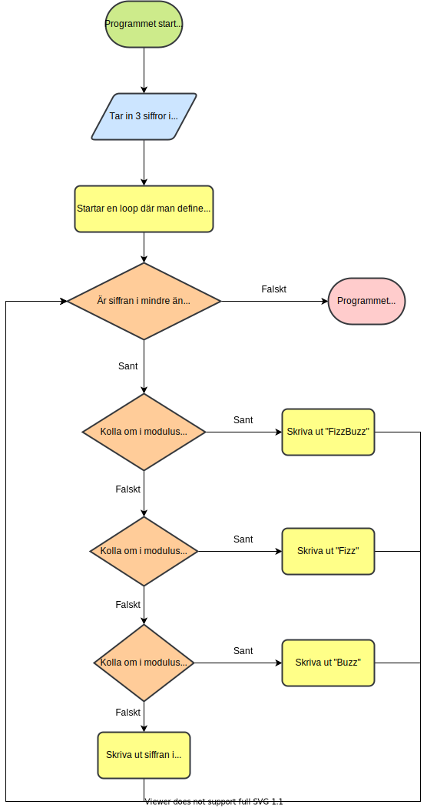

# FizzBuzz Utmaningen
FizzBuzz är ett klassiskt första programmerings problem som man löser när man lär sig programmering. Problemet går ut på 
att lära sig att ta emot in-data, skriva ut data, använda sig av if-else satser och loopar. Man kan göra detta i 
valfritt 
programmeringsspråk. Om ni söker detaljer för att skicka in för 
Hacktoberfest så är det bara att kolla [nedan](#att-skicka-in-för-hacktoberfest).

## Beskrivning av FizzBuzz problemet
Man kommer ta in 3 siffror i konsolen benämnd `X Y N` där siffrorna är separerade med mellanslag. Programmet ska sedan 
skriva ut alla heltal från 1 till och med siffran *N* varav tal som är delbart med *X* ska bytas ut till order `Fizz`. 
Medan tal som är delbart med *Y* ska bytas ut till `Buzz` och tal som är både delbart med *X* och *Y* ska bytas ut till 
`FizzBuzz`.

### Exempel resultat
#### Exempel 1 Input
```
2 3 7
```
#### Exempel 1 Output
```
1
Fizz
Buzz
Fizz
5
FizzBuzz
7
```
---
#### Exempel 2 Input
```
2 4 7
```
#### Exempel 2 Output
```
1
Fizz
3
FizzBuzz
5
Fizz
7
```
---
#### Exempel 3 Input
```
3 5 7
```

#### Exempel 3 Output
```
1
2
Fizz
4
Buzz
Fizz
7
```
---

Man kan även testa sitt program på Kattis om man vill, det kan man göra [här](https://open.kattis.com/problems/fizzbuzz).

## Ledtråd
Om du har fastnat på hur man ska göra så finns det en flödesdiagram som kan visa ett sätt man kan lösa problemet.



Här är några tips, det mesta språken har en form av loop som kallas for loopar där de automatiskt definierar en 
variabel i ich ökar den med 1. Sedan för att kunna ta in data från konsolen så finns det objekt/funktioner för att 
ta in dem såsom [Scanner i Java](https://www.w3schools.com/java/java_user_input.asp), [Scanf i C](https://www.geeksforgeeks.org/all-forms-of-formatted-scanf-in-c/) 
eller [input metoden i Python](https://www.w3schools.com/python/python_user_input.asp). Sedan för att kolla 
delbarheten av något så finns det en operator känd som modulus vilket ger resten av en division och oftast betecknas 
med **%**.

## Att skicka in för Hacktoberfest
Om man vill skicka in en pull request i denna repositoryn så får man först registrera sig för Hacktoberfest och sen 
forka den här repot ([som nämnt här](https://github.com/hd-chalmers/utmanings-samling#hur-deltar-man-i-hacktoberfest)). 
Sen bör man lägga i sin lösning en egen mapp och inte i början när man gör en pull request i denna repot. Sen 
uppskattas det om man gör den kreativaste lösningen man kan istället för det mest optimala löningen för skoj skull. 
Lycka till! 😜
